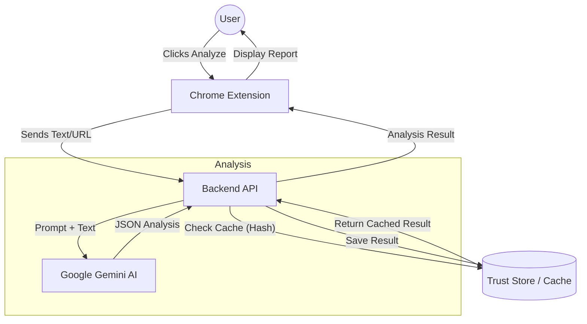

# 🦦 Otto 
> **Your AI-powered legal assistant that reads the fine print so you don't have to.**

Otto is a friendly Chrome Extension that analyzes Terms & Conditions, Privacy Policies, and other legal texts using Google's Gemini AI. It identifies risks, detects "dark patterns," and summarizes key points to help you protect your digital rights.

## 🏗️ Project Structure

*   **`extension/`**: Chrome Extension (Manifest V3, React, TypeScript, Vite, Tailwind CSS).
*   **`backend/`**: Node.js Backend (Fastify, TypeScript, Gemini SDK, Zod).
*   **`landing/`**: The project's landing/marketing page.

### System Architecture



## 🚀 Setup & Installation

You can set up Otto using **Docker (Recommended)** or manually using Node.js.

### Prerequisites
*   **Google Gemini API Key**: Get one for free at [aistudio.google.com](https://aistudio.google.com/).
*   **Docker Desktop** (for Docker setup) **OR** **Node.js v18+** (for manual setup).

---

### Option 1: Docker Setup (Recommended)
*No need to install Node.js on your machine!*

#### 1. Configure the API Key
Navigate to the `backend/` folder and create a file named `.env`:
```bash
GEMINI_API_KEY=your_actual_api_key_here
```

#### 2. Start the Backend
Open a terminal in the project root and run:
```bash
docker-compose up --build
```
The server is now running at `http://localhost:3000`. Keep this terminal open.

#### 3. Build the Extension
Open a **new** terminal in the project root and run this command to build the extension using a temporary container:

**Windows (PowerShell):**
```powershell
docker run --rm -v "${PWD}\extension:/app" -w /app node:20-alpine /bin/sh -c "npm install && npm run build"
```

**Mac/Linux:**
```bash
docker run --rm -v "$(pwd)/extension:/app" -w /app node:20-alpine /bin/sh -c "npm install && npm run build"
```

---

### Option 2: Manual Setup
*Requires Node.js v18+ installed.*

#### 1. Backend Setup
```bash
cd backend
npm install
# Create .env file with GEMINI_API_KEY=...
npm run dev
```

#### 2. Extension Setup
```bash
cd extension
npm install
npm run build
```

---

### 📂 Loading into Chrome
Once you have built the extension (using either method above), you will have a `dist` folder inside `extension/`.

1.  Open Chrome and go to `chrome://extensions/`.
2.  Enable **Developer mode** (toggle in the top right).
3.  Click **Load unpacked**.
4.  Select the **`extension/dist`** folder.

## 🦦 Usage

1.  Ensure the backend server is running.
2.  Navigate to any webpage containing Terms & Conditions (e.g., a signup page or footer link).
3.  Click the **Otto** icon in your Chrome toolbar.
4.  Click **Analyze Terms**.
5.  Watch Otto react as he reads, thinks, and presents the risk assessment!

## 🛠️ Tech Stack

*   **Frontend**: React, Tailwind CSS, Vite
*   **Backend**: Node.js, Fastify, Zod
*   **AI**: Google Gemini (via `@google/genai` SDK)
*   **Containerization**: Docker & Docker Compose
*   **Language**: TypeScript throughout